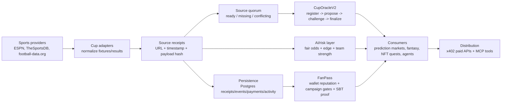

# XSight CupOS Architecture One-Pager

## One-Line Architecture

XSight CupOS is **sports outcome infrastructure for World Cup builders** on X Layer: sports data adapters, source receipts, UMA-like settlement, AI fair odds, x402 APIs, MCP tools, and FanPass reputation in one backend.

## Stack Map

## Layer Responsibilities

| Layer | Comparable benchmark | What CupOS does |
|---|---|---|
| Sports data | SportsDataIO / SportMonks / ESPN | Fetches fixtures/results, normalizes provider payloads, and produces source receipts. |
| Settlement | UMA / Polymarket resolution | Applies optimistic settlement to World Cup outcomes through CupOracleV2 on X Layer. |
| Builder infra | Azuro-style infra thinking | Lets other apps build on shared primitives instead of rebuilding data, receipts, and settlement. |
| Agent access | x402 Bazaar / MCP tools | Exposes paid APIs and agent-readable tools for fixture, outcome, risk, reputation, and action-plan access. |
| Consumer proof | Sorare-style fantasy/NFT demand | Shows FanPass, Fantasy Quest Builder, and AgentBet as consumers of the same backend. |

## Tab Logic

### CupHub

CupHub is the core console. It loads fixtures, receipts, adapter readiness, persistence health, oracle state, AI fair odds, settlement checks, and builder surfaces. Its main rule is simple: **no source quorum, no settlement proposal**. If providers are missing, rate-limited, or conflicting, CupHub shows the real state and blocks unsafe finality.

### FanPass

FanPass is the reputation layer. It scores wallets from x402 usage, CupHub activity, oracle participation, wallet history, and stored activity where available. Unknown wallets stay low/unknown. Campaigns can use FanPass before quests, reward claims, NFT mint gates, community access, or agent delegation.

### AgentBet

AgentBet is a reference AI consumer, not a betting marketplace. It observes CupHub, reads fair odds and settlement status, checks FanPass guardrails, builds an action plan, and requires approval before any action. Valid outputs include `NO_TRADE`, `WAIT`, `HEDGE_PREP`, and `APPROVAL_REQUIRED`.

## Source Of Truth

| Question | Source of truth |
|---|---|
| What match exists? | Sports provider adapters and receipts |
| Can the result settle? | Source quorum plus CupOracleV2 state |
| Is the final result canonical? | CupOracleV2 finalized state after challenge window |
| Should an app trade or hedge? | AI fair odds/risk layer as signal only |
| Can a wallet claim higher-value rewards? | FanPass score plus oracle finality |
| Can an agent consume it? | x402 APIs and MCP tools |

## Judge-Safe Framing

Use:

- "CupHub is the backend for World Cup apps on X Layer."
- "Azuro-like infrastructure thinking, UMA-like settlement, SportsDataIO-like inputs, x402/MCP distribution."
- "AgentBet is a reference consumer with approval-before-action."
- "FanPass is campaign/reputation infrastructure."

Avoid:

- "We are Polymarket."
- "AgentBet is an autonomous betting bot."
- "Sentiment resolves outcomes."
- "FanPassSBT is a full NFT marketplace."
