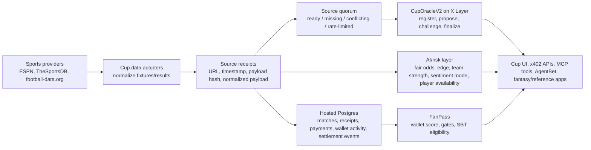

# XSight CupOS Product Architecture + Functional Specification

## Purpose

CupOS is **sports outcome infrastructure for World Cup builders** on X Layer. It combines sports data adapters, source receipts, UMA-like optimistic settlement, AI fair odds, x402 paid APIs, MCP tools, and FanPass reputation.

This document is the working product architecture for the Cup section: `CupHub`, `FanPass`, and `AgentBet`. It describes what each tab must do, where data comes from, how data updates, which conditions block actions, and which dependencies must be configured.

## System Architecture

### Source Of Truth Rules

| Domain | Source of truth | Rule |
|---|---|---|
| Fixtures and raw match facts | Sports providers | ESPN is the default free source. TheSportsDB and football-data.org enrich when keys exist. |
| Provider evidence | Source receipts | Every normalized provider payload should carry URL, observed timestamp, payload hash, confidence, and compact normalized payload. |
| Settlement readiness | Source quorum | Final result proposal is blocked unless real sources agree or an allowed operator attestation path is explicitly implemented. |
| Canonical finality | CupOracleV2 | Apps must wait for oracle finalization and challenge-window closure before final payouts or winner rewards. |
| AI edge / odds | XSight intelligence layer | Signals only. AI edge, sentiment, and fair odds are never canonical settlement truth. |
| Wallet trust | FanPass | FanPass score gates rewards and agent delegation; unknown wallets stay low/unknown. |
| Paid builder access | x402 middleware | Paid `/api/v1/cup/*` endpoints require payment proof in production; dev-bypass is development-only. |
| Agent access | MCP tools | MCP tools expose read/action-plan capabilities; mutating oracle writes are not exposed as normal MCP tools in MVP. |

## Data Refresh Model

- On first Cup load, the frontend requests Cup overview, adapters, persistence, readiness, and track proof.
- The backend caches provider feed data for a short interval, then refreshes from configured providers.
- Selecting a match reloads match-specific data: oracle state, settlement check, fair odds, AI edge, team strength, sentiment mode, player stats, settlement log, FanPass SBT eligibility, and fantasy quest.
- After any write action, the selected match details must reload instead of assuming success from the transaction response.
- Manual refresh should refetch overview and selected match data.
- Optional polling can be used for live matches and challenge windows, but the UI must keep explicit stale/loading/error states.
- If providers are unavailable, production must show `source_quorum_unavailable`, `provider_rate_limited`, or `conflicting_sources`; it must not silently switch to seeded fixtures.

## CupHub Tab

### Role

CupHub is the core infrastructure console. It should answer: can another team build a prediction market, fantasy game, NFT quest, social campaign, trading tool, or AI agent on top of XSight instead of rebuilding sports data and settlement?

### Blocks And Responsibilities

| Block | Responsibility | Main data |
|---|---|---|
| Hero / selected match summary | Explain CupHub and show selected fixture state. | `/api/cup/overview`, selected match |
| Fixture Registry | List real provider fixtures and let the user select one. | `matches` from `/api/cup/overview` |
| Source Receipts / Evidence | Show provider URLs, payload hashes, observed timestamps, confidence, normalized payload preview. | selected match receipts |
| Settlement Panel | Show rules/source/evidence hashes, source quorum, propose/challenge/finalize status, tx log. | `/api/cup/settlement-check`, `/api/cup/onchain/:matchId`, `/api/cup/settlement-log` |
| Oracle Proof Panel | Show CupOracleV2 address, selected match id, current state, source count, evidence URI, explorer links. | `/api/cup/readiness`, oracle state |
| Reference Market Consumer | Show how a prediction market should consume CupHub and block payouts until finality. | static copy + `examples/cuphub-reference-market.ts` |
| AI Edge / Fair Odds | Show fair probabilities, decimal odds, confidence, risk, suggested edge, rationale. | `/api/cup/ai-edge`, `/api/cup/fair-odds` |
| Signal Adapters | Show team strength, sentiment mode, and player stats availability. | `/api/cup/team-strength`, `/api/cup/sentiment`, `/api/cup/player-stats` |
| Source Adapter Readiness | Show which providers are configured/live/disabled and how many real sources are available. | `/api/cup/adapters` |
| Hosted Persistence | Show database health and explain durable receipt/event/payment storage. | `/api/cup/persistence` |
| Builder Surface | Show x402 endpoints, MCP tools, curl snippets, integration examples, and live wallet Pay & Call. | `/api/v1/x402-spec`, `/mcp`, static snippets |
| Track Proof Center | Show judge-readable proof rows for each hackathon track. | `/api/cup/track-proof` |
| Fantasy Quest Builder | Show GameFi/fantasy consumer logic that depends on FanPass and oracle finality. | `/api/cup/fantasy-quest` |

### Load Flow

1. On tab open, request:
   - `GET /api/cup/overview`
   - `GET /api/cup/adapters`
   - `GET /api/cup/persistence`
   - `GET /api/cup/readiness`
   - `GET /api/cup/track-proof`
2. Pick the first available match, or show an honest no-fixtures state.
3. On match select, request:
   - `GET /api/cup/matches/:matchId`
   - `GET /api/cup/onchain/:matchId`
   - `GET /api/cup/settlement-check?matchId=...`
   - `GET /api/cup/settlement-log?matchId=...`
   - `GET /api/cup/ai-edge?matchId=...`
   - `GET /api/cup/fair-odds?matchId=...`
   - `GET /api/cup/team-strength?matchId=...`
   - `GET /api/cup/sentiment?matchId=...`
   - `GET /api/cup/player-stats?matchId=...`
   - `GET /api/cup/fantasy-quest?matchId=...&wallet=...`
4. If a request fails, the UI should keep the last stable selected match but show a visible error/empty state in the failed panel.

### Settlement Conditions

Settlement proposal is blocked when:

- no selected match exists;
- match has no real provider receipts;
- source quorum is `source_quorum_unavailable`;
- providers disagree and status is `conflicting_sources`;
- provider error is `provider_rate_limited`;
- match is not registered or CupOracleV2 is not configured;
- `CUP_WRITE_API_ENABLED=false`;
- production write endpoint has no valid `CUP_WRITE_API_KEY`;
- settlement is already finalized;
- challenge window is active and normal final payout messaging would be unsafe.

Normal settlement lifecycle:

1. Fixture exists and receipts are visible.
2. Match is registered with `rulesHash`, `initialSourceHash`, and `evidenceUri`.
3. When a final result has source quorum, operator proposes outcome with `evidenceHash`, `evidenceUri`, and `sourceCount`.
4. Challenge window opens.
5. If challenged, consumers pause payouts and rewards.
6. If unchallenged and window closes, finalize.
7. Downstream apps treat final oracle outcome as canonical.

### Failure States

| State | UI behavior | Product meaning |
|---|---|---|
| `source_quorum_unavailable` | show receipts/errors and disable proposal | not enough real sources agree |
| `provider_rate_limited` | show provider issue and retry guidance | source fetch failed due to rate limit |
| `conflicting_sources` | show conflicting outcomes and block proposal | providers disagree |
| `settlement_challenged` | show dispute/challenge state and pause payouts | result is not final |
| player stats unavailable | show unavailable state, not blank card | player feed is optional and not fabricated |
| DB offline | show persistence warning while live reads continue | durable receipts/events may not be stored |

### x402 Pay & Call Flow

The Pay & Call button is a judge-facing proof of the paid builder API model. It is not a charge for browsing CupHub.

1. Builder, app, or AI agent chooses a paid Cup endpoint such as `/api/v1/cup/ai-edge?matchId=...`.
2. UI reads `/api/v1/x402-spec` for `payTo`, `asset`, `assetAddress`, `decimals`, `network`, and endpoint price.
3. Connected wallet sends an explicit ERC20 USDT transfer on X Layer.
4. UI waits for the transaction receipt.
5. UI retries the API request with `X-PAYMENT` as base64 JSON containing `payTo`, `amount`, `asset`, `network`, `txHash`, and `payer`.
6. Backend verifies the transfer log and rejects replayed tx hashes.
7. If verified, the endpoint returns paid machine-readable Cup intelligence JSON.

Blocked states: wallet not connected, wrong network, placeholder match/wallet params, invalid asset config, rejected wallet signature, unconfirmed tx, insufficient transfer amount, replayed tx hash, or endpoint-specific API failure.

## FanPass Tab

### Role

FanPass is the reputation and anti-Sybil module for World Cup apps. It is a secondary proof layer that shows how CupHub can gate campaigns, rewards, NFT claims, fantasy access, and agent delegation.

### Blocks And Responsibilities

| Block | Responsibility | Main data |
|---|---|---|
| Wallet Identity Header | Show wallet, copy/open explorer, current tier. | connected wallet or input wallet |
| Fan Score Meter | Show 0-100 score, tier, verdict, trust explanation. | `GET /api/v1/cup/fan-score?wallet=...` |
| Score Breakdown | Explain x402 usage, Cup interactions, on-chain activity, consistency, oracle participation. | FanPass score response |
| Campaign Gate Simulator | Show basic quest, active fan reward, trusted access, oracle contributor gate. | FanPass score + rules |
| NFT Claim Gate | Show how NFT mints/winner moments are gated. | FanPass score + selected match finality |
| FanPass SBT Proof | Show eligibility hash, SBT contract, minted/eligible/blocked state. | `GET /api/cup/fanpass/sbt-eligibility?wallet=...` |
| Risk Handling | Explain low score, suspicious activity, DB offline, unresolved oracle states. | FanPass + persistence + selected match |
| Integration Surface | Show API/MCP call shape for builders. | `/api/v1/cup/fan-score`, `get_fan_score` |

### Data Logic

- FanPass reads wallet-level activity from x402 usage, CupHub interactions, settlement events, wallet history, and hosted persistence where configured.
- Unknown wallets stay `unknown` or low-trust. The UI must never invent high scores to look good.
- No activity means basic/read-only access only.
- DB offline means live wallet checks may still work, but durable app-specific history is unavailable.
- Oracle-unresolved matches must not count as final win/reward proof.

### SBT Logic

- `GET /api/cup/fanpass/sbt-eligibility?wallet=...` returns eligibility, score, tier, eligibility hash, contract metadata, and minted state.
- `POST /api/cup/fanpass/sbt-mint` is a write endpoint and must be gated by `CUP_WRITE_API_KEY`.
- Mint is blocked when wallet is invalid, score is below threshold, contract is not configured, or the wallet already has a badge.
- FanPassSBT is a non-transferable campaign proof badge, not an NFT marketplace.
- The UI can show a `Mint FanPass SBT` action when eligible and not minted. If the backend requires `CUP_WRITE_API_KEY`, the key must be entered only for that request and must not be stored in frontend code, local storage, docs, or logs.

### Gate Rules

| Gate | Expected behavior |
|---|---|
| Basic fan quest | available to low/basic wallets if wallet is valid |
| Active fan reward | requires higher FanPass activity and no obvious farming signal |
| Trusted community access | requires trusted tier or manual review |
| Oracle contributor campaign | requires oracle-grade actions or explicit review |
| Winner NFT / winner reward | requires FanPass eligibility plus finalized CupOracle outcome |

## AgentBet Tab

### Role

AgentBet is a reference AI consumer proving CupHub can power agents. It must not be pitched as a betting marketplace, custody product, or autonomous gambling bot.

### Blocks And Responsibilities

| Block | Responsibility | Main data |
|---|---|---|
| Agent Workflow | Visualize Observe -> Decide -> Approve -> Verify. | selected match + action plan |
| Match Selector | Reuse CupHub fixtures and source status. | `/api/cup/overview` |
| Agent Trace | Show tool/API steps, inputs, compact outputs, statuses. | `POST /api/cup/action-plan` |
| Action Plan | Show primary action, guardrails, API calls, xLayer actions. | `POST /api/cup/action-plan` |
| Risk & Hedge Planner | Show fair odds, risk decision, hedge readiness, blocked reason. | action plan + AI edge + fair odds |
| Signal Stack | Show AI edge, team strength, sentiment mode, player stats, settlement status. | selected match detail APIs |
| Execution Safety | Explain approval, spend limit, no auto execution, oracle recheck. | action plan + settlement state |
| Reference Consumer Proof | Link/copy reference market/fantasy behavior. | examples + builder copy |

### Agent Flow

1. Observe: read fixtures, receipts, source hash, and settlement status.
2. Decide: read AI edge, fair odds, team strength, FanPass guardrails, and settlement risk.
3. Plan: call `POST /api/cup/action-plan` with `{ matchId, mode: "agent" }`.
4. Approve: present `NO_TRADE`, `WAIT`, `HEDGE_PREP`, or `APPROVAL_REQUIRED`; never execute automatically.
5. Verify: before any external app payout/trade/claim, recheck CupOracle state and challenge window.

### Action Decisions

| Decision | Meaning |
|---|---|
| `NO_TRADE` | valid safe output when AI edge is weak or risk is high |
| `WAIT` | source quorum missing, challenged, or finality unavailable |
| `HEDGE_PREP` | signals can be prepared, but oracle finality or approval is still required |
| `APPROVAL_REQUIRED` | action may be executable only after user approval and oracle recheck |

Execution is blocked when source quorum is missing, settlement is challenged, FanPass score is too low for delegated actions, liquidity/route is unavailable, payment is required, or the user has not approved.

## Public API And MCP Surface

### Core Cup APIs

- `GET /api/cup/overview`
- `GET /api/cup/adapters`
- `GET /api/cup/persistence`
- `GET /api/cup/readiness`
- `GET /api/cup/track-proof`
- `GET /api/cup/matches/:matchId`
- `GET /api/cup/onchain/:matchId`
- `GET /api/cup/settlement-log?matchId=...`
- `GET /api/cup/result/:matchId`
- `GET /api/cup/player-stats?matchId=...`
- `GET /api/cup/ai-edge?matchId=...`
- `GET /api/cup/fair-odds?matchId=...`
- `GET /api/cup/settlement-check?matchId=...`
- `GET /api/cup/sentiment?matchId=...`
- `GET /api/cup/team-strength?matchId=...`
- `GET /api/cup/fan-score?wallet=...`
- `GET /api/cup/fanpass/sbt-eligibility?wallet=...`
- `GET /api/cup/fantasy-quest?matchId=...&wallet=...`
- `POST /api/cup/action-plan`

### Write APIs

- `POST /api/cup/propose-result`
- `POST /api/cup/challenge-result`
- `POST /api/cup/finalize-result`
- `POST /api/cup/fanpass/sbt-mint`

Write APIs must be disabled or protected unless `CUP_WRITE_API_ENABLED=true` and the caller provides the expected write key in protected environments.

### x402 Builder APIs

Paid `/api/v1/cup/*` endpoints expose builder-facing access to fixtures, result, AI edge, fair odds, settlement check, sentiment, team strength, player stats, FanPass score, and action plan. Production should verify real payment proof and reject replayed payments.

### MCP Tools

Expected agent-readable tools include:

- `get_cup_fixtures`
- `resolve_match`
- `get_cup_ai_edge`
- `get_cup_player_stats`
- `score_team_strength`
- `get_cup_sentiment`
- `verify_outcome`
- `get_cup_settlement_state`
- `get_fan_score`
- `build_cup_action_plan`

## Dependencies And Configuration

### Required For Production-Core Demo

- `X_LAYER_RPC_URL`: X Layer RPC for reads/writes.
- `DEPLOYER_PRIVATE_KEY`: dedicated low-fund signer for deploy/write scripts.
- `AGENTIC_WALLET_ADDRESS`: address derived from signer.
- `CUP_ORACLE_V2_ADDRESS`: deployed CupOracleV2 contract.
- `FANPASS_SBT_ADDRESS`: deployed FanPassSBT contract for NFT-track proof.
- `DATABASE_URL`: hosted Postgres for durable matches, receipts, payment receipts, settlement events, wallet activity.
- `X402_PAYOUT_ADDRESS`, `X402_NETWORK`, `X402_ASSET`, `X402_ASSET_ADDRESS`: payment verification and paid API config.
- `CUP_WRITE_API_KEY`: required for protected write endpoints in production.

### Optional / Provider Configuration

- `ESPN_SOURCE_ENABLED=true`: default free provider.
- `ESPN_SCOREBOARD_URL`: ESPN soccer scoreboard endpoint.
- `THESPORTSDB_API_KEY`, `THESPORTSDB_LEAGUE_ID`: metadata/event enrichment.
- `FOOTBALL_DATA_API_KEY`: optional keyed World Cup provider.
- `CUP_DEMO_MODE=false`: development-only seed mode; ignored as a production fallback.
- `ALLOW_DEV_BYPASS=false`: development-only x402 bypass; rejected in production.
- `VITE_AGENTATION_ENABLED=false`: dev-only annotation overlay; keep disabled for demo recording.

### Contract Dependencies

- CupOracleV2: rules hash, source hash, evidence hash, evidence URI, source count, proposed outcome, challenge state, final outcome.
- FanPassSBT: one non-transferable badge per wallet for campaign gating proof.

### Persistence Dependencies

Hosted Postgres should store:

- `cup_matches`
- `cup_source_receipts`
- `cup_settlement_events`
- `cup_payment_receipts`
- `cup_wallet_activity`

If persistence is offline, CupHub can still read live provider APIs, but the UI must show that durable receipts/events/payment replay storage are unavailable.

## Competitive Architecture

CupOS borrows proven patterns without claiming to replace the category leaders:

- Azuro proves infrastructure-over-frontend works for prediction applications. CupHub adopts the builder-backend thesis, but it is not a liquidity or AMM protocol.
- UMA proves optimistic resolution works. CupOracleV2 narrows that pattern to World Cup outcomes and X Layer evidence.
- Chainlink/Overtime prove sports feeds can power settlement and sports markets. CupHub adds x402, MCP, AI risk, and FanPass around sports outcome evidence.
- SportsDataIO, SportMonks, Sportradar, and Genius prove B2B sports data is a moat. CupHub is a lightweight agent-native Web3 layer over accessible providers.
- Sorare proves fantasy/NFT sports demand. CupHub is not a fantasy game; it is the backend a fantasy or NFT quest can consume.
- x402 Bazaar and MCP marketplaces prove paid agent-tool distribution. CupHub is the vertical sports/Cup version rather than a horizontal marketplace.

## Implementation Gaps To Watch

- Player stats are intentionally `unavailable` unless a real provider supplies them.
- Sentiment is currently input-only/unavailable and must not be used for settlement truth.
- Free provider coverage can be rate-limited or incomplete; source quorum may be unavailable during demo.
- The UI can show write buttons, but production write actions require proper gating and should not be exposed without `CUP_WRITE_API_KEY`.
- FanPass score quality depends on real wallet/payment/activity history; unknown wallets should remain low-trust.

## MVP Non-Goals

- Do not build CupLP.
- Do not make AgentBet a full marketplace.
- Do not let MCP tools mutate on-chain state in normal MVP flows.
- Do not claim sentiment is canonical truth.
- Do not claim official enterprise sports data coverage unless provider contracts support it.
- Do not finalize user payouts before CupOracle finality.

## Demo Order

1. CupHub: show fixture registry, receipts, source status, and honest quorum state.
2. CupHub: show Oracle Proof Panel and settlement lifecycle.
3. CupHub: show AI edge, fair odds, signal adapters, and player stats unavailable state if relevant.
4. FanPass: show wallet score, campaign gates, NFT/SBT proof, and risk handling.
5. AgentBet: show Agent Trace, action plan, Risk & Hedge Planner, and approval-before-action.
6. Builder surface: show x402 endpoints, MCP tools, Track Proof Center, and examples.
